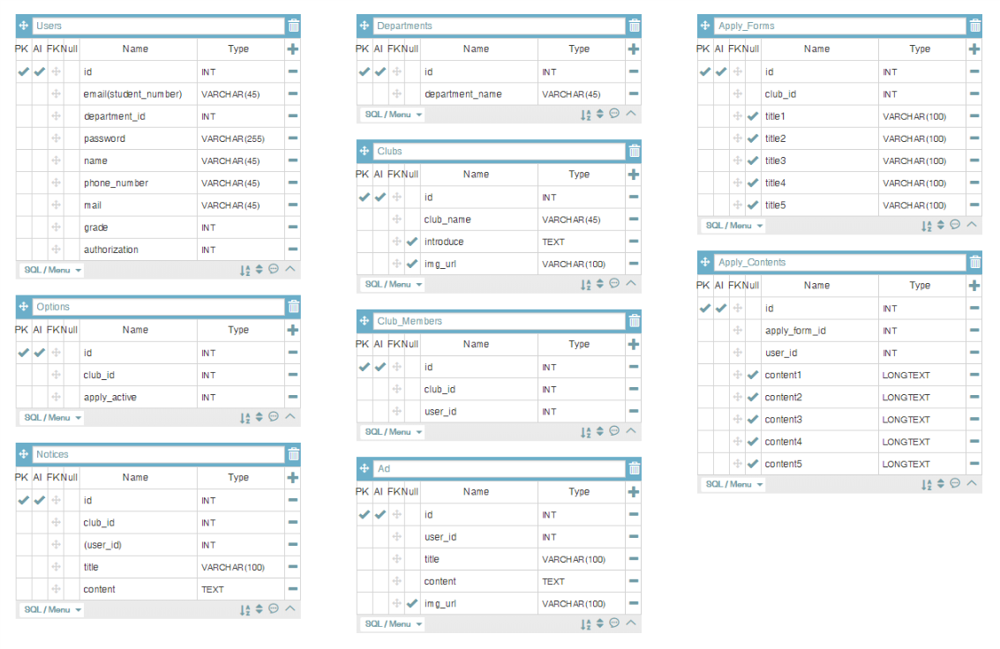

# SKHU 단체(소모임 & 동아리) 활성 웹 서비스
### 3주 / 의사소통 / 주석

## Database Prototype

## TODO
* model 관계 설정 및 확인 (현재 Notice, Ad는 없음)
* 승래 - devise custom
* 진경 - Apply_Forms & Apply_Contents
* 현수 - Clubs & Club_Members & Options
* 결, 다은 - Front Prototype

## CRUD
* **C: Create**
* **R: Read**
* **U: Update**
* **D: Delete**

## Front-End
* 로그인 & 회원가입
* 회원 정보 수정 (RU View)
* 각 단체의 소개 (RU View)
* 지원 양식 (RU View) - 단체마다 다른 양식
* 현재 지원 가능 단체 모아보기 (R View)
* Notice & Ad (CRU View)
* 각 단체 회원 명단 현황 (R View)
* 각 단체 지원자 현황 (R View)
* Options Table (U View)                    *
* 전체 회원 목록 (R View)
* 단체 등록 (C View)

## Back-End (기능 단위)
* 로그인, 회원가입, 로그아웃, 회원정보수정 기능  *완성(승래)
* 현재 지원 가능 단체 모아보기 R            * 완성(현수)
* 각 단체의 Notice 게시판의 CRUD
* 통합 Ad 게시판의 CRUD
* 각 단체의 회원 명단 RD(Club Admin)        * 완성(현수)
* 각 단체의 소개 U (Club Admin)             * 완성(현수)
* 각 단체의 지원 양식 U (Club Admin)        * 완성(진경)
* 각 단체의 지원자 조회 R (Club Admin)      * 완성(진경)
* 각 단체의 Options Table U (Club Admin)    * 완성(현수)
* 전체 회원 목록 R (Super Admin)            * 완성(현수)
* 단체 CD (Super Admin)                     * 완성(현수)

## Author
* 김승래
    * devise 커스텀완료
    * 회원정보수정 완료
    * youtube 영상업로드 게시판 작성중
* 함진경
    * 지원 양식 작성, 수정 완료
    * 지원서 작성 완료
    * 지원내용 확인(동아리 관리자는 지원자목록보기, 지원자는 자신이 지원한 내용보기)
    * 지원자 멤버로 수락하기
    * 
* 한현수
    * 단체 CD(사이트 관리자만 가능) 완성
    * 각 단체의 회원 명단록 RD(단체에 속해있는 일반 유저(p태그), 해당 단체 관리자 또는 사이트 관리자(a태그)) 완성
    * 전체 회원 목록 R(사이트 관리자만 가능) 완성
    * 옵션 테이블 U 완성
    * 각 단체의 소개 U 완성
    * 지원 내용 확인하는 과정 변경(전: /club/club_view/:club_id -> apply_content/index, 후: /users/index -> apply_content/index -> apply_content/user_application_view/:apply_content_id)
     
-----------------------------------
    FE 할 일:
        /club/edit_club  => 동아리 소개 수정 => done
        /video/new       => 동영상 등록=> done
        /apply_form/edit => 지원양식 수정 => done
        /apply_content/  => 지원내용확인하기  => done
        동아리 목록보기에서 width값 키우기
        

        웹 표준에 맞춰 이미지마다 설명글 적기(웹접근성 표준을 준수하는 것) 이 거왜 무섭게 빨간색으로 나오지;;

     
-----------------------------------     
    
    +a
        팀창업 수업에서 밝은 색에 흰색 글씨라 잘 안 보인다는 피드백이 있었음. 논의해보자.
        
        지원가능한 동아리 추가
        seed에 동아리 추가. 
        
        seed에 그럴듯한 내용들 넣기. -> 시연에 필요
-----------------------------------    
    
    BE 할 일:
        /club/appliable_club에서 Apply active가 1인데도 클럽이 안보이는 문제 해결하기(seed 문제 해결완료)
        /club/club_view/에서 권한 '1','2'일때 안보여야할 부분이 보임 이부분 빨리 수정하기(해결 완료)
        apply_finished db테이블 만들기(이미 마감되서 불필요한 apply_content테이블을 저장하는 테이블, Read만 가능, 용도는 예전에 썻던 동아리 신청서를 볼수 있음, 결형이 요청함)
        
        지원자 내용 확인에서 지원자 기본 인적사항 보이게 하기.

-----------------------------------    
* 
* 박결
*   * login form 작업 예정 -> 끝
*   * sign_up form 작업 예정 -> 끝
*   * apply_content 작업 예정 -> 끝
*   * pagenation 작업 -> 보류
*   * 회원 목록 디자인 -> done
*   * video 등록 
*   
    반응형 <보류> 
    *  index에 반응형 웹 입히기.
    *    1. nav 반응형 작업하기 ( 모바일 사이즈에서는 nav바를 슬라이드로 표현)
*       
*    

* 홍다은
*   * website 디자이너
*   * nav bar 작업(완료) -> 로고 포토샵으로 작업 후 이미지 교체 예정
*   * index 작업(완료)
*   * footer 작업(중)
